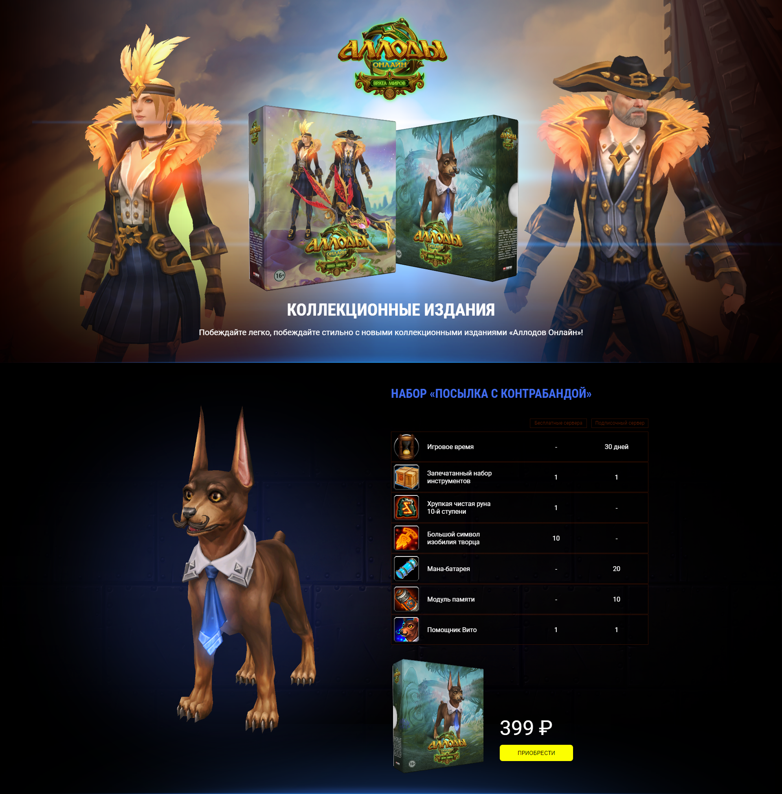

# test-task-allods

## Тестовое задание на Frontend Junior developer — лендинг с десктопным дизайном

### Демо: [https://pryadadev.github.io/test-task-allods](https://pryadadev.github.io/test-task-allods)

### Stack: React, JavaScript, CSS, Webpack (create-react-app).

### Ограничения:
- Ограничений не было дано, поэтому я взял в качестве ограничений требования к вакансии:
- HTML, CSS, JavaScript, ReactJS
- Photoshop, Figma
- Git, SVN

### Функционал:
1) Просто вёрстка десктопного лендинга без дополнительного функционала
2) Всё кроме текста в первой секции и правой половины во второй расположено абсолютно
3) Только десктопный дизайн только для разрешения экрана 1920x1080, т.к. макет только такой и дополнительных требований не было
4) Чтобы сайт полностью совпадал с макетом, скрыл скроллбар, который отнимал немного ширины.
